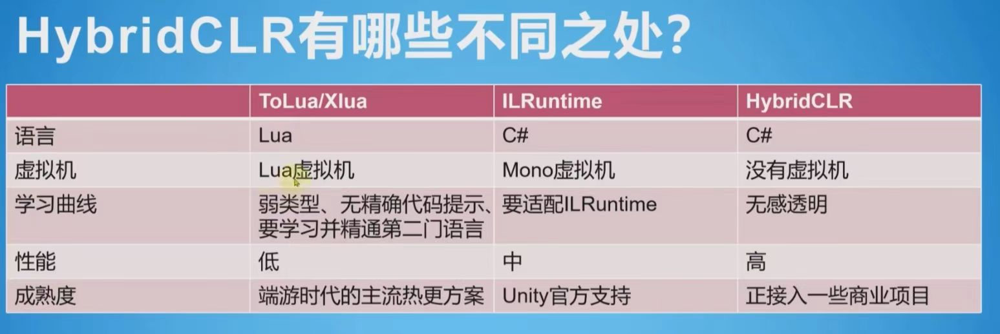
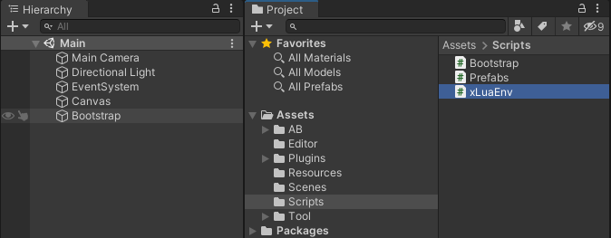
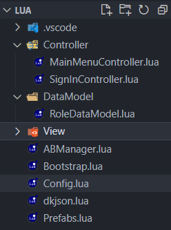

# xLua快速使用

将xlua源码中Assets下的Plugins和XLua文件夹复制到Unity项目下Assets目录中即可。

更多查看源码中的教程

附：源码等
[(xLuaGithub地址)](https://github.com/Tencent/xLua)



# 在lua中实现资源加载生成页面并可更新数据

## 前期准备
场景建立，创建目录，并导入必要文件，xLua资源导入。


## 资源打包
将MainMenu预制体和其文件依赖，使用Export.cs打包成AB包。

## 生命周期
在Bootstrap.cs中，建立委托和结构体实现将C#生命周期函数映射至lua中，在lua中实现生命周期。

## lua目录
建立MVC目录结构，Bootstrap.lua作为主脚本，创建必要工具脚本。


## AB包管理
创建ABManager.lua实现AB包加载，依赖加载，资源加载。
Prefabs.lua负责资源的初始化。

## Controller层
在Controller层创建不同脚本以满足不同功能实现，创建MainMenuController.lua生成menu面板。Bootstrap.lua中将该表加入核心表中管理并调用生命周期函数使得MainMenuController.lua同样具有生命周期。

## Model层
Model层中创建RoleDataModel.lua负责数据管理，新建数据，读取数据，修改数据，保存数据。
主要使用dkjson.lua实现将文本以json格式解析并转换为lua能使用的数据结构类型。解码和编码。
数据以json格式保存在持久化目录中。

## 具体实现
在MainMenuController.lua的Start函数中，加载AB包加载资源，生成物体到场景中。通过RoleDataModel初始化数据并保存在本地变量data中。用返回的数据给面板赋值，创建不同的按钮监听方法，并给按钮绑定监听事件。创建移除按钮监听的主函数，在OnDestroy()中执行。

## 注意事项
在Dispose之前，必须将所有的委托置为null.lua中实现的事件回调也需要反注册等。这里主要是C#中生命周期的映射，需要置null，lua中对按钮的事件绑定需要移除监听。**注：**  *使用RemoveListener*并不会完全移除该事件，可能是因为Unity中cache了该回调。解决办法：再Invoke一次。
```CSharp
Button.onClick:RemoveAllListeners();
Button.onClick:Invoke();
```
